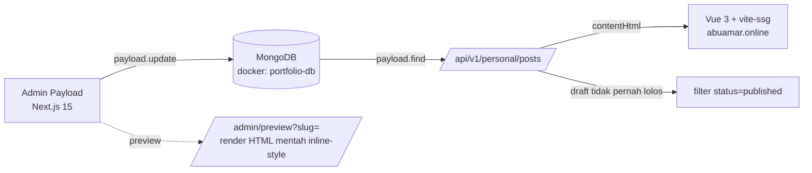
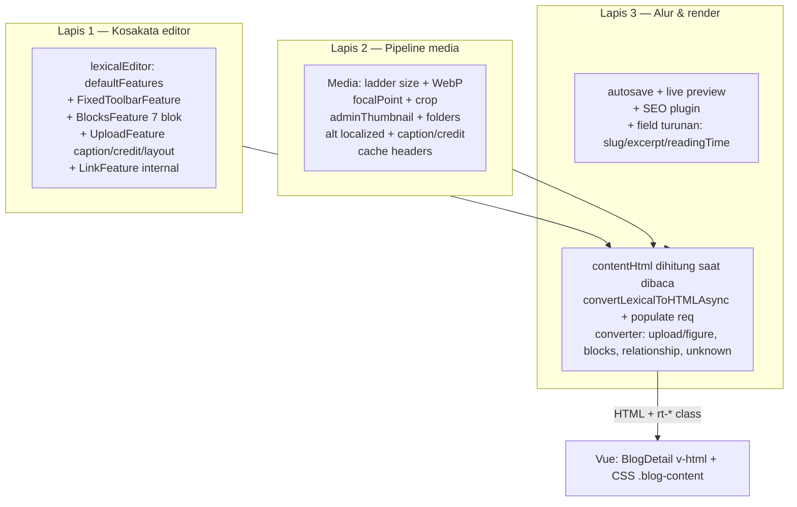

# Riset: Authoring Blog di Payload CMS — kenapa terasa susah, dan desain perbaikannya

**Tanggal**: 2026-09-10
**Status**: riset saja — belum ada satu baris kode yang diubah
**Target versi**: `payload@3.86.0`, `@payloadcms/richtext-lexical@3.86.0` (Lexical `0.41.0`), `@payloadcms/db-mongodb@3.86.0`, Next.js 15 App Router, frontend Vue 3 + vite-ssg
**Metode**: pembacaan `dist/*.d.ts` dari paket 3.86.0 yang terpasang di `next/cms/node_modules`, source pada git tag `v3.86.0`, dokumentasi resmi (`payloadcms.com/docs`), API produksi (`backend.abuamar.online`), dan data MongoDB yang dapat dijangkau dari repo.

> Catatan kejujuran sumber: dokumentasi di payloadcms.com saat ini menyajikan 3.88 (`payload@latest`). Semua klaim API di dokumen ini diverifikasi ulang terhadap `v3.86.0`, bukan `main`. Temuan yang hanya berasal dari komunitas (issue/discussion) ditandai eksplisit.

---

## 0. TL;DR — 8 keputusan

| # | Keputusan | Kenapa itu akar masalahnya | Biaya | Dampak |
|---|---|---|---|---|
| 1 | Tambah `FixedToolbarFeature()` | Toolbar tetap **tidak aktif secara default**; saat ini tombol format hanya muncul sebagai *floating toolbar* setelah teks diseleksi. Sebelum menyeleksi apa pun, editor tampak seperti kotak kosong tanpa kendali | ~3 baris | ★★★★★ |
| 2 | Tambah `BlocksFeature` dengan 7 blok terkurasi | Tidak ada mekanisme apa pun untuk membuat elemen bergaya (sorotan, kutipan, galeri, embed, blok kode, poin kunci). Inilah arti "tidak bisa custom style" | 1 file blok + config | ★★★★★ |
| 3 | Perkaya `Media` (ladder size, `adminThumbnail`, `displayPreview`, WebP, focal point, folder) | Koleksi media seadanya: drawer/list tanpa thumbnail (memilih gambar = buta), tanpa konversi format, `alt` tanpa konteks pemakaian → **0 dari 9 post produksi punya gambar** | 1 file | ★★★★★ |
| 4 | Ganti pipeline `contentHtml` → dihitung **saat dibaca** (`lexicalHTMLField` / `afterRead` + `convertLexicalToHTMLAsync`) | Sekarang HTML hanya dibuat saat publish, ditulis dari dalam `afterChange` dengan `payload.update()` ke koleksi yang sama (anti-pattern yang didokumentasikan; guard anti-loop justru dihapus di commit `ccaaa67`), dan memakai converter **deprecated** | 1 field + 1 modul converter | ★★★★☆ |
| 5 | Tulis converter sendiri untuk `upload`, `blocks`, `relationship`, `unknown` | Converter default tidak ada untuk `block`/`relationship` (hilang senyap sebagai `<span>unknown node</span>`), dan converter `upload` default menghasilkan `<picture>` dengan **satu kandidat per `<source>`** — bukan responsive image, tanpa caption, tanpa `sizes`, tanpa lazy | 1 file | ★★★★☆ |
| 6 | Set `serverURL` (atau absolut-kan URL di converter) | `payload.config.ts` tidak menyetel `serverURL` → URL media relatif (`/api/media/file/x.webp`). Di situs statis `dev.abuamar.online`/`abuamar.online`, gambar akan diminta dari origin portfolio → 404 | 1 baris | ★★★★☆ |
| 7 | `versions.drafts.autosave` + Live Preview ke aplikasi Vue asli + plugin SEO | Tanpa autosave, draf hilang kalau lupa klik; preview saat ini merender halaman CMS sendiri dengan `style` inline (tidak ada hubungannya dengan desain asli); field SEO tidak ada sama sekali (aksi `seo` di AI Helper menyuruh copy manual ke field yang tak eksis) | sedang | ★★★★☆ |
| 8 | Perbaiki UI `.blog-content` (figure, varian lebar, callout, galeri, embed, code) | CSS portfolio sudah menata `p/h/code/pre/ul/table`, tapi tidak punya `figure`/`figcaption`, varian lebar, atau gaya blok baru — tanpa ini blok baru akan tampil mentah | 1 file CSS | ★★★★☆ |

Urutan pengerjaan yang disarankan: **1 + 2 + 3 → 4 + 5 + 6 → 8 → 7** (lihat §8).

---

## 1. Peta sistem hari ini



| Lapis | Berkas kunci | Kondisi |
|---|---|---|
| Editor | `payload.config.ts` (`editor: lexicalEditor()`), `collections/Posts.ts` | 20 fitur default; tanpa toolbar tetap, tanpa blok |
| Media | `collections/Media.ts` | 2 ukuran, tanpa thumbnail admin, tanpa konversi format |
| Workflow | `collections/Posts.ts` (`versions.drafts`, `admin.preview`), `app/(payload)/admin/preview/page.tsx` | autosave mati; preview bukan desain asli; tanpa SEO |
| Render | `collections/Posts.ts` hook `afterChange`, `app/api/v1/personal/posts/route.ts` | HTML dibuat saat publish, converter deprecated |
| Konsumsi | `portfolio/src/pages/BlogDetail.vue`, `src/assets/main.css` (`.blog-content`) | `v-html`; CSS belum menata blok baru |
| Asisten | `components/admin/AIHelperWrapper.tsx` | menulis Lexical paragraph-only; aksi `seo` copy-paste manual |

---

## 2. Diagnosis per lapis

### 2.1 Editor — "kenapa tidak ada tombol apa pun?"

`payload.config.ts` memanggil `lexicalEditor()` **tanpa argumen** → Payload memakai `defaultEditorFeatures`. Daftar persisnya (dibaca dari `node_modules/@payloadcms/richtext-lexical/dist/lexical/config/server/default.js`, versi 3.86.0):

```
BoldFeature, ItalicFeature, UnderlineFeature, StrikethroughFeature,
SubscriptFeature, SuperscriptFeature, InlineCodeFeature,
ParagraphFeature, HeadingFeature, AlignFeature, IndentFeature,
UnorderedListFeature, OrderedListFeature, ChecklistFeature,
LinkFeature, RelationshipFeature, BlockquoteFeature,
UploadFeature, HorizontalRuleFeature, InlineToolbarFeature
```

**Yang TIDAK ada (dan itu persis keluhan "inputnya kurang enak"):**

| Fitur | Status default | Efek yang dirasakan penulis |
|---|---|---|
| `FixedToolbarFeature` | ❌ tidak ada | Tidak ada tombol terlihat sebelum menyeleksi teks; format hanya via floating toolbar/markdown |
| `BlocksFeature` | ❌ tidak ada | Tidak bisa menyisipkan elemen bergaya apa pun |
| Blok kode (`CodeBlock`) | ❌ tidak ada | Artikel teknis tidak bisa menampilkan kode rapi |
| `TextStateFeature` (highlight/warna) | ❌ tidak ada | Tidak bisa menandai teks penting |
| `EXPERIMENTAL_TableFeature` | ❌ tidak ada | Tidak bisa tabel (padahal CSS frontend sudah menata `table`) |
| `UploadFeature` | ✅ ada (block-level) | Drag & drop, paste gambar, drawer media, dan "create new" sudah berfungsi. Ini bukan penyebab gambar tak dipakai (§2.2) |
| Slash menu `/` | ✅ otomatis | Entri hanya muncul dari fitur yang aktif — jadi menu `/` sekarang isinya cuma paragraph/heading/list/quote/hr/upload/link |
| Markdown shortcut | ✅ otomatis | `**bold**`, `# `, `> `, `---`, `` ` `` berfungsi, tapi tidak terlihat oleh penulis |

Bukti tak langsung dari data produksi: dari 9 post, seluruh node yang pernah dipakai hanya **4 tipe** — `paragraph` ×47, `heading` ×36, `list` ×10, `quote` ×4. Tidak ada gambar, kode, embed, tabel. Penulis tidak menulis elemen yang tidak bisa dibuat.

### 2.2 Media — gambar tidak pernah dipakai

`collections/Media.ts` saat ini: `staticDir: 'public/media'`, `mimeTypes: ['image/*']`, dua size (`thumbnail` 300×300, `card` 800×450), dan satu field `alt` (required, **tidak** localized).

| Yang hilang | Akibat nyata |
|---|---|
| `adminThumbnail: 'thumbnail'` | List media dan **drawer pemilihan gambar di editor tidak menampilkan thumbnail** → memilih gambar = menebak dari nama file. Mekanismenya: field turunan `thumbnailURL` hanya terisi kalau `upload.adminThumbnail` diset (diverifikasi di `payload/dist/uploads/getBaseFields.js`, hook `afterRead`: `filename: typeof adminThumbnail === 'string' ? originalDoc.sizes?.[adminThumbnail]?.filename : undefined`) |
| `displayPreview: true` | Tidak ada preview di dalam field upload saat menulis post |
| `formatOptions` (WebP/AVIF) | Semua gambar asli disimpan apa adanya; JPEG 4 MB tetap 4 MB |
| Ladder size yang lengkap (`content`/`content2x`/`hero`/`og`) | Tidak ada kandidat `srcset` untuk artikel; tidak ada varian OG 1200×630 |
| `withoutEnlargement: true` per size | Size bisa `null` (default `undefined` = "kalau asli lebih kecil, jangan buat") → konsumen `srcset` harus null-safe |
| `folders: true`, `defaultColumns` | Library tidak bisa ditelusuri saat jumlah gambar bertambah |
| `pastikan alt` punya konteks + `caption`/`credit` di tingkat dokumen | `alt` wajib tapi tanpa panduan; caption/credit tidak bisa disimpan |
| `modifyResponseHeaders` | File yang dilayani `staticDir` **tidak** menyetel `Cache-Control` (terverifikasi di `uploads/endpoints/getFile.ts`) |
| `focalPoint`/`crop` | Sebenarnya aktif (default `true`) dan selector muncul karena `imageSizes` ada — tapi tanpa dokumentasi/panduan, tidak dipakai |

Fakta produksi: **0 dari 9 post punya `coverImage`**, **0 node `upload`** di seluruh isi post. Artinya jalur gambar — yang secara teknis *sudah bisa* — tidak pernah dipakai. Penyebabnya bukan editor, tapi ketiadaan pipeline yang layak + tidak ada jalan gambar masuk ke dalam artikel (caption/credit/varian lebar tidak ada), sehingga gambar hanya "tempelan".

### 2.3 Workflow — pekerjaan klerikal + preview palsu

| Temuan | Bukti |
|---|---|
| Autosave mati | `versions: { drafts: true }` saja; `autosave` tidak diset (default off) → draf hilang jika lupa klik Save draft |
| Preview tidak menampilkan desain asli | `admin.preview: (doc) => '/admin/preview?slug=' + doc.slug` dan `app/(payload)/admin/preview/page.tsx` merender `<h1 style=…>` + HTML mentah. Penulis tidak pernah melihat tampilan sebenarnya |
| Draf tidak bisa dipreview di situs asli | `app/api/v1/personal/posts/route.ts` memfilter `status: { equals: 'published' }` di semua jalur — tidak ada jalur `draft`/token |
| Tidak ada field SEO | `@payloadcms/plugin-seo` tidak terpasang; aksi `seo` di `AIHelperWrapper` menyusun pesan *"Copy these values into the appropriate fields"* untuk field yang tidak ada |
| Tags = array of rows | `tags: [{ tag: text }]` → menambah tag berarti klik "Add Tag" per tag (AI Helper bahkan memanggil `form.addFieldRow` berulang) |
| Slug manual + `beforeValidate` fallback | Sudah ada fallback slugify dari title, tapi `unique: true` + `localized: true` → tabrakan antar-locale sulit dipahami saat error |
| `author` wajib diisi manual | Relationship ke `users` tanpa `defaultValue` |
| Naskah duplikat | 9 post, **6 di antaranya adalah varian artikel yang sama** (4 dengan judul identik "Kenapa AI Lebih Rapi Kalau Pakai Design System yang Sudah Ada"). Ini jejak paling jelas bahwa alurnya bikin frustrasi: artikel yang sama dibuat ulang berkali-kali untuk "mencari yang benar" |

### 2.4 Pipeline render — pembunuh senyap

`collections/Posts.ts` → `hooks.afterChange`:

```ts
if (doc.status === 'published' && doc.content) {
  const { convertLexicalToHTML, defaultHTMLConverters } = await import('@payloadcms/richtext-lexical')
  const html = await convertLexicalToHTML({ data: doc.content, converters: defaultHTMLConverters, req })
  await req.payload.update({ collection: 'posts', id: doc.id, data: { contentHtml: html } })
  return { ...doc, contentHtml: html }
}
```

Empat masalah sekaligus:

1. **Loop berpotensi tak berujung.** `payload.update()` ke koleksi yang sama dari `afterChange` adalah anti-pattern yang didokumentasikan Payload (solusi resminya: flag di `req.context`). Git membuktikan ini: commit `ccaaa67` *"rewrite Posts afterChange hook — always regenerate contentHtml"* menghapus guard `!doc.contentHtml` yang semula mencegah loop. Efek samping: rantai hook yang sama juga memuat `createAuditLogHook('posts')` dan `postWebhook` → setiap penulisan ulang internal berpotensi menggandakan entri audit dan memicu webhook/rebuild tambahan. *(Status: risiko terverifikasi dari kode + dokumentasi; saya tidak dapat membuktikan duplikasi baris di DB produksi karena DB produksi ada di dalam jaringan Docker VPS — lihat §2.6.)*
2. **Draf tidak punya HTML.** `contentHtml` hanya diisi saat `status === 'published'` → semua preview/hydration draf kosong atau basi.
3. **Konverter deprecated.** Impor dari root paket (`convertLexicalToHTML`) mengarah ke *stack lama* (`lexicalToHtml_deprecated`) yang ditandai `@deprecated — akan dihapus di 4.0`. Jalur modern: `@payloadcms/richtext-lexical/html` (sync) atau `/html-async` (dengan `populate`).
4. **Tidak ada konverter untuk blok/relasi.** `defaultHTMLConverters` hanya berisi `paragraph, text, linebreak, quote, table, heading, horizontalrule, list, listitem, link, autolink, upload, tab`. Tidak ada `block`, `inlineBlock`, `relationship`, `unknown` → node blok/relasi hilang jadi `<span>unknown node</span>` (dan blok menulis `console.error`), jadi begitu blok ditambahkan tanpa converter, hasil di frontend kosong tanpa error yang terlihat penulis.

**Converter `upload` bawaan juga tidak layak pakai.** Terverifikasi dari `dist/features/upload/server/index.js` (3.86.0): jika media punya `sizes`, output-nya

```html
<picture>
  <source srcset="…-300x300.webp" media="(max-width: 300px)" type="image/webp">
  <source srcset="…-800x450.webp" media="(max-width: 800px)" type="image/webp">
  " alt="…" width="…" height="…">
</picture>
```

Itu **bukan** responsive image: setiap `<source>` hanya satu kandidat, urutan bergantung urutan objek `sizes`, tidak ada atribut `sizes`, tidak ada `loading="lazy"`/`decoding`, dan pada viewport lebar browser jatuh ke `` (gambar asli). Ditambah: tidak ada `<figure>`/`<figcaption>` → caption/credit mustahil.

**URL relatif.** `payload.config.ts` tidak menyetel `serverURL` (env `PAYLOAD_PUBLIC_SERVER_URL` ada di `.env.example` tapi tidak dipakai di config). URL media jadi relatif; di situs statis, `/api/media/file/...` akan diambil dari origin portfolio → 404. Ini akan muncul persis saat gambar pertama dipakai.

**CSS frontend belum siap.** `portfolio/src/assets/main.css` (`:.blog-content`, sekitar baris 248–348) sudah menata `h1–h4, p, a, strong, code, pre, ul/ol, blockquote, img, hr, table` — tetapi **tidak ada** `figure`, `figcaption`, varian lebar (inset/wide/full-bleed), callout, galeri, embed, dan penanda bahasa blok kode.

### 2.5 Bukti dari data produksi

Diambil dari `https://backend.abuamar.online/api/v1/personal/posts?limit=100`:

| Fakta | Nilai |
|---|---|
| Post | 9 (semua `published`) |
| Post duplikat/near-duplikat | 6 (`ai-pakai-design-system-draft`, `ai-pakai-design-system-2`, `ai-pakai-design-system`, `kenapa-ai-lebih-rapi-…`, `kenapa-ai-pakai-design-system`, `ai-design-system-existing`) |
| Punya `coverImage` | 0 |
| Node `upload` di isi artikel | 0 |
| Tipe node dipakai | `paragraph`, `heading`, `list`, `quote` |
| Drift `content` vs `contentHtml` | Diverifikasi ulang lewat endpoint `?slug=`: `koleksi-komponen-copy-paste-claude-codex` punya `content` 1 node tapi `contentHtml` 3.179 char; `hello-world` `content` kosong (0 node) tapi `contentHtml` 92 char (sisa HTML lama) |
| Slug artikel utama | `kenapa-ai-lebih-rapi-kalau-pakai-design-system-yang-sudah-ada` (juga dijadikan route prerender oleh `vite.config.ts`) |

Konsekuensi langsung: 5 dari 11 halaman blog hasil prerender adalah salinan artikel yang sama — pembaca dan crawler melihat duplikasi, dan penulis menghabiskan energi mengulang.

### 2.6 Catatan ops (di luar UX, tapi menentukan cara kerja)

- **Produksi memakai MongoDB internal Docker.** `docker-compose.yml` menyetel `DATABASE_URL: mongodb://portfolio:…@portfolio-db:27017/portfolio`, sementara `.env` di repo mengarah ke Atlas `clusteramr…/portfolio` yang isinya hanya **2 post, 0 media** (data Juli–Agustus). Artinya: dev lokal di repo ini ≠ data produksi; menguji perubahan blok secara lokal akan memakai DB basi.
- **Media disimpan di volume Docker** `cms-media:/app/public/media` → bertahan antar-deploy (bagus), tapi `staticDir: 'public/media'` berada di dalam `public/` Next sehingga file juga dapat diakses langsung di `/media/...` — tidak masalah untuk blog publik, catat saja.
- **`docker-compose.yml` ikut ter-commit dengan password Mongo plaintext** (`git ls-files` mengonfirmasi tracked; `.gitignore` hanya menutup `.env`). Sebaiknya pindahkan ke `env_file`/secret dan rotasi password.

---

## 3. Arsitektur target (3 lapis)



Prinsip yang dipakai:

1. **Satu jalan yang jelas untuk setiap kebutuhan** (menghindari dua cara melakukan hal yang sama): gambar di badan artikel = node upload yang diperkaya (drag-drop + caption), galeri = satu blok.
2. **Kosakata dibatasi** (7 blok). Setiap blok = satu komponen Vue + satu converter + permukaan QA; blok ke-20 adalah utang, bukan fitur.
3. **HTML adalah target render, bukan format simpanan.** Lexical JSON tetap sumber kebenaran; HTML dihitung saat dibaca → perubahan markup = deploy, bukan backfill.
4. **Penulis hanya mengurus konten**; slug/excerpt/reading time/SEO diisi otomatis atau oleh tombol generate.

---

## 4. Rekomendasi berperingkat

### P0 — membuka jalan (kerjakan lebih dulu)

| ID | Item | Perubahan konkret | Berkas |
|---|---|---|---|
| P0-1 | Toolbar tetap + kurasi heading | `FixedToolbarFeature()`, `HeadingFeature({ enabledHeadingSizes: ['h2','h3','h4'] })` | `payload.config.ts` |
| P0-2 | Blok terkurasi | `BlocksFeature({ blocks: [Callout, PullQuote, Gallery, Embed, CodeBlock, KeyTakeaways, Divider] })` | `blocks/*.ts`, `payload.config.ts` |
| P0-3 | Gambar dengan caption/credit/varian lebar | `UploadFeature({ enabledCollections: ['media'], collections: { media: { fields: [caption, credit, layout] } } })` | `payload.config.ts` |
| P0-4 | Ladder media + WebP + focal + thumbnail admin + folder | lihat §5.3 | `collections/Media.ts` |
| P0-5 | `contentHtml` dihitung saat dibaca | ganti field `textarea` hidden + blok `afterChange` dengan `lexicalHTMLField({ storeInDB: false })` + converter sendiri | `collections/Posts.ts`, `richtext/htmlConverters.ts` |
| P0-6 | URL absolut | `serverURL: process.env.PAYLOAD_PUBLIC_SERVER_URL` (atau absolut-kan di converter) | `payload.config.ts` |
| P0-7 | CSS blok & varian lebar di frontend | tambahan `.blog-content` (`figure`, `--inset/--wide/--full`, callout, galeri, embed, code) | `portfolio/src/assets/main.css` |
| P0-8 | Bersihkan relasi yang hilang senyap | converter `relationship` + `unknown`, dan `RelationshipFeature({ enabledCollections: ['posts','media'] })` | `richtext/htmlConverters.ts`, `payload.config.ts` |

### P1 — alur kerja setara newsroom

| ID | Item | Perubahan konkret | Berkas |
|---|---|---|---|
| P1-1 | Autosave | `versions: { drafts: { autosave: { interval: 800 }, validate: false }, maxPerDoc: 50 }` | `collections/Posts.ts` |
| P1-2 | Live Preview ke aplikasi Vue asli | `admin.livePreview` (url + breakpoints) + `@payloadcms/live-preview-vue` di portfolio + `cors`/`csrf` | `payload.config.ts`, portfolio |
| P1-3 | Preview draf bertoken (bukan JWT di URL) | `preview` fn → halaman `/preview` portfolio, token/secret divalidasi server-side, API v1 menerima `draft=true` | `collections/Posts.ts`, `app/api/v1/personal/posts/route.ts`, portfolio |
| P1-4 | Plugin SEO | `seoPlugin({ collections: ['posts'], uploadsCollection: 'media', tabbedUI: true, generateTitle/Description/Image/URL })`; hapus aksi `seo` manual di AI Helper | `payload.config.ts`, `AIHelperWrapper.tsx` |
| P1-5 | Field turunan | `beforeValidate`: slug; `beforeChange`: excerpt (dari paragraf pertama) + `readingTime`; `author` `defaultValue` = user saat ini via hook | `collections/Posts.ts` |
| P1-6 | Tags & taksonomi | ganti `tags: [{ tag }]` → `text hasMany` (ketik + Enter) atau `categories` relationship `hasMany` + `tags text hasMany` | `collections/Posts.ts` |
| P1-7 | List view | `listSearchableFields: ['title','slug']` (+ index), `defaultColumns: ['title','_status','publishedAt','updatedAt']`, `enableQueryPresets`, `trash: true` | `collections/Posts.ts` |
| P1-8 | Guard hook | semua efek samping (`postWebhook`, audit) dicek terhadap `req.context` + `req.query?.autosave` supaya autosave tidak memicu rebuild/webhook | `hooks/postWebhook.ts` |
| P1-9 | Jadwal publish | `schedulePublish: true` **hanya jika** ada runner job (`payload jobs:run --cron …`); tanpa itu jadwal tidak pernah dieksekusi | `collections/Posts.ts`, ops |

### P2 — lapisan kenyamanan (setelah P0/P1 stabil)

| ID | Item | Catatan |
|---|---|---|
| P2-1 | `TextStateFeature` (highlight/mark) | API `@experimental`; **wajib** tulis converter `text` sendiri karena state tersimpan di kunci `"$"` dan converter default mengabaikannya |
| P2-2 | `EXPERIMENTAL_TableFeature` | Eksperimental; CSS tabel sudah siap |
| P2-3 | Tombol toolbar "Sisipkan Gambar/Galeri" | `createClientFeature` + `INSERT_BLOCK_COMMAND`, label id/en; hanya jika drawer blok terasa lambat |
| P2-4 | Lightbox galeri & tombol copy pada blok kode | Progressive enhancement dari atribut `data-block` (tanpa mengubah konverter) |
| P2-5 | AI Helper yang benar | Markdown → Lexical via `convertMarkdownToLexical({ editorConfig, markdown })` (butuh `editorConfigFactory.fromField`), bukan parser paragraf buatan sendiri; opsional pembuatan `alt` otomatis lewat hook media |
| P2-6 | Backfill konten lama | Isi cover+alt untuk 4 artikel yang dipertahankan, hapus 5 duplikat, tambah kategori |

---

## 5. Implementasi konkret

### 5.1 `payload.config.ts`

```ts
import {
  lexicalEditor, BlocksFeature, FixedToolbarFeature, HeadingFeature,
  LinkFeature, RelationshipFeature, UploadFeature,
} from '@payloadcms/richtext-lexical'
import { seoPlugin } from '@payloadcms/plugin-seo'   // versi HARUS persis 3.86.0 (peer dep eksak)
import { Callout } from './blocks/Callout'
import { PullQuote } from './blocks/PullQuote'
import { Gallery } from './blocks/Gallery'
import { Embed } from './blocks/Embed'
import { KeyTakeaways } from './blocks/KeyTakeaways'
import { Divider } from './blocks/Divider'

const FRONTEND = process.env.FRONTEND_URL || 'http://localhost:5175'

export default buildConfig({
  // P0-6: tanpa ini URL media relatif → gambar 404 di situs statis
  serverURL: process.env.PAYLOAD_PUBLIC_SERVER_URL || 'https://backend.abuamar.online',

  // P1-2: live preview dari admin ke aplikasi Vue
  cors: [FRONTEND, 'https://abuamar.online', 'https://dev.abuamar.online'],
  csrf: [FRONTEND],
  admin: {
    user: Users.slug,
    importMap: { baseDir: dirname },
    livePreview: {
      url: ({ data, collectionConfig, locale }) => {
        if (collectionConfig?.slug !== 'posts' || !data?.slug) return null
        const q = locale?.code ? `?locale=${locale.code}&preview=1` : '?preview=1'
        return `${FRONTEND}/blogs/${data.slug}${q}`
      },
      breakpoints: [
        { label: 'Mobile', name: 'mobile', width: 390, height: 844 },
        { label: 'Tablet', name: 'tablet', width: 834, height: 1112 },
        { label: 'Desktop', name: 'desktop', width: 1440, height: 900 },
      ],
      collections: ['posts'],
    },
    components: { views: { dashboard: { Component: '/components/admin/Dashboard' } } },
    meta: { titleSuffix: ' | Abu Amar CMS', description: 'Content Management System for Abu Amar' },
  },

  editor: lexicalEditor({
    features: ({ defaultFeatures }) => [
      ...defaultFeatures,                       // urutan penting: duplikat → yang TERAKHIR menang
      HeadingFeature({ enabledHeadingSizes: ['h2', 'h3', 'h4'] }),
      FixedToolbarFeature(),                    // P0-1
      LinkFeature({                             // link ke artikel lain + field rel
        enabledCollections: ['posts'],
        maxDepth: 1,
        internalDocToHref: ({ linkNode }) => `/blogs/${linkNode.value?.slug ?? ''}`,
      }),
      RelationshipFeature({ enabledCollections: ['posts', 'media'], maxDepth: 1 }),
      UploadFeature({                           // P0-3: caption/credit/varian lebar per PENEMPATAN
        enabledCollections: ['media'],
        maxDepth: 2,
        collections: {
          media: {
            fields: [
              { name: 'caption', type: 'text', admin: { description: 'Keterangan di bawah gambar.' } },
              { name: 'credit',  type: 'text', admin: { description: 'Kredit foto, mis. "Dok. Pribadi".' } },
              {
                name: 'layout', type: 'select', defaultValue: 'content',
                options: [
                  { label: 'Konten (maks 45rem)', value: 'content' },
                  { label: 'Sempit (inset)', value: 'inset' },
                  { label: 'Lebar', value: 'wide' },
                  { label: 'Penuh (full-bleed)', value: 'full' },
                ],
              },
            ],
          },
        },
      }),
      BlocksFeature({ blocks: [Callout, PullQuote, Gallery, Embed, KeyTakeaways, Divider] }),
      // CodeBlock() dari paket yang sama (@experimental) ditambahkan sebagai elemen ke-7:
      // CodeBlock({ defaultLanguage: 'ts', languages: { plaintext: 'Plain text', ts: 'TypeScript', bash: 'Shell', json: 'JSON' } })
    ],
  }),

  plugins: [
    seoPlugin({                                 // P1-4
      collections: ['posts'],
      uploadsCollection: 'media',
      tabbedUI: true,
      generateTitle: ({ doc }) => `${doc?.title ?? ''} — Abu Amar`,
      generateDescription: ({ doc }) => doc?.excerpt ?? '',
      generateImage: ({ doc }) => doc?.coverImage ?? '',
      generateURL: ({ doc }) => `https://abuamar.online/blogs/${doc?.slug ?? ''}`,
    }),
  ],

  localization: { locales: [{ label: 'Indonesia', code: 'id' }, { label: 'English', code: 'en' }], defaultLocale: 'id', fallback: true },
  collections: [Users, Posts, Media, /* … */],
  db: mongooseAdapter({ url: process.env.DATABASE_URL || '' }),
  sharp,
})
```

### 5.2 Blok terkurasi (7)

```ts
// blocks/Callout.ts
import type { Block } from 'payload'

export const Callout: Block = {
  slug: 'callout',
  labels: { singular: { id: 'Sorotan', en: 'Callout' }, plural: { id: 'Sorotan', en: 'Callouts' } },
  admin: { disableBlockName: true, group: 'Teks' },
  fields: [
    {
      name: 'tone', type: 'select', required: true, defaultValue: 'info',
      options: [
        { label: { id: 'Info', en: 'Info' }, value: 'info' },
        { label: { id: 'Tips', en: 'Tip' }, value: 'tip' },
        { label: { id: 'Peringatan', en: 'Warning' }, value: 'warning' },
      ],
    },
    { name: 'title', type: 'text' },
    { name: 'body', type: 'textarea', required: true },
  ],
}
```

| Blok | Field inti | Kenapa ada |
|---|---|---|
| `callout` | `tone` (info/tip/warning), `title`, `body` | Menonjolkan catatan tanpa bikin HTML manual |
| `pullQuote` | `quote`, `attribution`, `role` | Kutipan besar khas artikel |
| `gallery` | `images[]` (2–9: `image`, `caption`) | Banyak gambar sebagai satu unit, bukan N node berserakan |
| `embed` | `provider` (allowlist: youtube/x/instagram), `url`, `caption` | Video/sosial tanpa iframe mentah |
| `code` | pakai `CodeBlock()` bawaan (`languages`, `defaultLanguage`) | Artikel teknis |
| `keyTakeaways` | `title`, `items[]` (3–5 poin) | Ringkasan untuk skimming/SEO |
| `divider` | `style` (line/dots/space) | Pemisah bagian bergaya (HR polos tetap ada) |

**Yang sengaja TIDAK dibuat**: blok `figure` terpisah. Gambar tunggal sudah punya jalur tercepat (drag & drop node upload yang kini membawa caption/credit/layout) — menambah blok figure berarti dua cara untuk hal yang sama. Juga tidak ada blok "HTML kustom" / field HTML bebas: itu pintu masuk XSS dan meruntuhkan kosakata desain.
Tidak ada `blocks` bersarang (Lexical di dalam Lexical) — histori bug 3.8x menyangkut nested lexical/array rows, dan tidak ada kebutuhan nyata.

### 5.3 `collections/Media.ts`

```ts
import type { CollectionConfig } from 'payload'

export const Media: CollectionConfig = {
  slug: 'media',
  folders: true,                          // P0-4: penelusuran library (root-level, bukan admin.folders)
  admin: {
    group: 'Blog',
    useAsTitle: 'filename',
    description: 'Semua gambar situs. Isi alt (id + en), atur titik fokus setelah unggah, lalu pakai dari editor.',
    defaultColumns: ['filename', 'alt', 'width', 'height', 'filesize', 'updatedAt'],
  },
  access: { /* seperti sekarang */ },
  upload: {
    staticDir: 'public/media',
    mimeTypes: ['image/*'],
    adminThumbnail: 'thumbnail',          // list & drawer jadi terlihat
    displayPreview: true,                 // preview di dalam field upload saat menulis
    crop: true,
    focalPoint: true,
    resizeOptions: { width: 2560, withoutEnlargement: true },   // jangan simpan JPEG kamera 6000px
    formatOptions: { format: 'webp', options: { quality: 82 } },// hanya untuk ORIGINAL — size perlu sendiri
    imageSizes: [
      { name: 'thumbnail', width: 400, height: 300, position: 'centre', withoutEnlargement: true },
      { name: 'card',      width: 640,  withoutEnlargement: true },
      { name: 'card2x',    width: 1280, withoutEnlargement: true },
      { name: 'content',   width: 800,  withoutEnlargement: true },
      { name: 'content2x', width: 1600, withoutEnlargement: true },
      { name: 'hero',      width: 1600, withoutEnlargement: true },
      { name: 'og',        width: 1200, height: 630, position: 'centre', withoutEnlargement: true },
    ],
    modifyResponseHeaders: ({ headers }) => {
      headers.set('Cache-Control', 'public, max-age=604800, stale-while-revalidate=86400')
    },
  },
  fields: [
    {
      name: 'alt', type: 'text', localized: true, required: true,
      admin: { description: 'Deskripsi untuk pembaca layar. Jangan tulis nama file, jangan awali "gambar".' },
      validate: (value: unknown) => {
        const v = typeof value === 'string' ? value.trim() : ''
        if (!v) return 'Alt wajib diisi.'
        if (v.length > 160) return 'Maksimal 160 karakter.'
        if (/\.(jpe?g|png|webp|avif|gif|svg)$/i.test(v)) return 'Jangan pakai nama file sebagai alt.'
        return true
      },
    },
    { name: 'caption', type: 'text', localized: true },
    { name: 'credit',  type: 'text' },
  ],
}
```

Catatan penting: `.env` produksi memakai `PAYLOAD_PUBLIC_SERVER_URL` — pastikan nilainya diisi agar §5.5 (URL absolut) bekerja; jika tidak, absolut-kan di converter.

### 5.4 `collections/Posts.ts`

```ts
import { lexicalHTMLField } from '@payloadcms/richtext-lexical'
import { convertLexicalToPlaintext } from '@payloadcms/richtext-lexical/plaintext'
import { htmlConvertersAsync } from '../richtext/htmlConverters'

export const Posts: CollectionConfig = {
  slug: 'posts',
  admin: {
    group: 'Blog',
    useAsTitle: 'title',
    defaultColumns: ['title', '_status', 'publishedAt', 'updatedAt'],
    listSearchableFields: ['title', 'slug'],
    livePreview: { /* diwarisi dari admin.livePreview global */ },
    // admin.preview lama + /admin/preview dihapus setelah P1-3 siap
  },
  versions: {
    maxPerDoc: 50,
    drafts: { autosave: { interval: 800 }, validate: false },
  },
  access: {
    read: ({ req }) => {
      if (req.user) return true
      // _status ada sejak awal (drafts sudah aktif), jadi tidak perlu cabang `exists:false`
      return { _status: { equals: 'published' } }
    },
    create: ({ req }) => req.user?.role === 'admin' || req.user?.role === 'editor',
    update: ({ req }) => req.user?.role === 'admin' || req.user?.role === 'editor',
    delete: ({ req }) => req.user?.role === 'admin',
  },
  fields: [
    { name: 'title', type: 'text', required: true, localized: true },
    { name: 'slug',  type: 'text', index: true, unique: true, localized: true, admin: { position: 'sidebar' } },
    { name: 'excerpt', type: 'textarea', maxLength: 300, localized: true,
      admin: { description: 'Dipakai sebagai meta description default dan ringkasan kartu.' } },
    { name: 'content', type: 'richText', required: true, localized: true },
    // P0-5: HTML dihitung saat dibaca; field ini tidak pernah dipersistensi.
    { ...lexicalHTMLField({
        htmlFieldName: 'contentHtml',
        lexicalFieldName: 'content',
        converters: htmlConvertersAsync,
      }),
      localized: true },
    { name: 'coverImage', type: 'upload', relationTo: 'media' },
    { name: 'tags', type: 'text', hasMany: true, localized: true, admin: { description: 'Ketik lalu Enter.' } },
    { name: 'readingTime', type: 'number', admin: { position: 'sidebar', readOnly: true, description: 'Menit, dihitung otomatis.' } },
    { name: 'publishedAt', type: 'date', admin: { position: 'sidebar', date: { pickerAppearance: 'dayAndTime' } } },
    { name: 'author', type: 'relationship', relationTo: 'users', required: true, admin: { position: 'sidebar' } },
  ],
  hooks: {
    beforeValidate: [({ data, req }) => {
      if (data?.title && !data?.slug) {
        data.slug = data.title.toLowerCase().replace(/[^a-z0-9]+/g, '-').replace(/^-|-$/g, '')
      }
      if (!data?.author && req.user?.id) data.author = req.user.id
      if (!data?.publishedAt && data?.status === 'published') data.publishedAt = new Date().toISOString()
      return data
    }],
    beforeChange: [({ data, originalDoc }) => {
      const src = data?.excerpt ?? originalDoc?.excerpt ?? ''
      const content = data?.content ?? originalDoc?.content
      const plain = content ? convertLexicalToPlaintext({ data: content }) : ''
      if (!src && plain) data.excerpt = plain.slice(0, 200).trim() + (plain.length > 200 ? '…' : '')
      const words = plain.split(/\s+/).filter(Boolean).length
      data.readingTime = Math.max(1, Math.round(words / 200))
      return data
    }],
    afterChange: [postWebhookGuarded, createAuditLogHook('posts')],   // tanpa penulisan ulang ke koleksi sendiri
    afterDelete: [createAuditDeleteHook('posts')],
  },
}
```

Yang hilang dari berkas ini justru intinya: **tidak ada lagi `req.payload.update()` di dalam `afterChange`**. `contentHtml` tidak disimpan ke DB (`storeInDB` default `false`), sehingga draf pun punya HTML segar, dan tidak ada loop/duplikasi audit/webhook.

`hooks/postWebhook.ts` perlu guard tambahan:

```ts
if (req.context?.skipWebhook) return doc          // seed/backfill
if (req.query?.autosave || req.query?.draft) return doc   // jangan rebuild tiap ketikan
```

### 5.5 `richtext/htmlConverters.ts`

```ts
import { convertLexicalToHTMLAsync, type HTMLConvertersFunctionAsync } from '@payloadcms/richtext-lexical/html-async'
import type { DefaultNodeTypes, SerializedBlockNode, SerializedUploadNode } from '@payloadcms/richtext-lexical'
import type { Callout, Gallery, PullQuote, Embed, KeyTakeaways, Media } from '../payload-types'

const CMS = (process.env.PAYLOAD_PUBLIC_SERVER_URL || 'https://backend.abuamar.online').replace(/\/$/, '')
const esc = (s: unknown) =>
  String(s ?? '').replace(/[&<>"']/g, (c) => ({ '&': '&amp;', '<': '&lt;', '>': '&gt;', '"': '&quot;', "'": '&#39;' }[c]!))
const abs = (u?: string | null) => (!u ? '' : /^https?:/i.test(u) ? u : `${CMS}${u}`)

/** srcset naik berdasarkan lebar, selalu null-safe (size bisa null kalau gambar asli lebih kecil). */
function responsive(m: Media, sizes: string) {
  const cand = [
    m.width ? { url: abs(m.url), w: m.width } : null,
    ...Object.values(m.sizes ?? {}).filter(Boolean).map((s) => (s!.width ? { url: abs(s!.url), w: s!.width } : null)),
  ].filter(Boolean) as { url: string; w: number }[]
  cand.sort((a, b) => a.w - b.w)
  return {
    src: abs(m.url),
    srcset: cand.map((c) => `${esc(c.url)} ${c.w}w`).join(', '),
    sizes,
  }
}

const figure = (m: Media, layout = 'content', caption?: string | null, credit?: string | null) => {
  const { src, srcset, sizes } = responsive(m, layout === 'full' ? '100vw' : '(min-width: 1024px) 45rem, 100vw')
  const cap = [caption, credit].filter(Boolean).map((t) => esc(t)).join(' — ')
  return `<figure class="rt-figure rt-figure--${layout}">` +
    `` +
    (cap ? `<figcaption class="rt-figure-caption">${cap}</figcaption>` : '') +
    `</figure>`
}

export const htmlConvertersAsync: HTMLConvertersFunctionAsync<
  DefaultNodeTypes | SerializedBlockNode<Callout | PullQuote | Gallery | Embed | KeyTakeaways>
> = ({ defaultConverters }) => ({
  ...defaultConverters,

  // Mengganti <picture> bawaan dengan <figure> + srcset nyata
  upload: ({ node, providedStyleTag }) => {
    const m = (node as SerializedUploadNode).value as Media | string | number
    if (!m || typeof m !== 'object') return ''          // node tak terpopulasi
    const f = (node as SerializedUploadNode).fields as { caption?: string; credit?: string; layout?: string } | undefined
    if (!m.mimeType?.startsWith('image')) {
      return `<a${providedStyleTag} class="rt-file" href="${esc(abs(m.url))}" rel="noopener noreferrer">${esc(m.filename)}</a>`
    }
    return figure(m, f?.layout ?? 'content', f?.caption, f?.credit)
  },

  blocks: {
    callout: ({ node }) => {
      const b = node.fields as Callout
      return `<aside class="rt-callout rt-callout--${esc(b.tone)}" role="note">` +
        (b.title ? `<p class="rt-callout-title">${esc(b.title)}</p>` : '') +
        `<p>${esc(b.body)}</p></aside>`
    },
    pullQuote: ({ node }) => {
      const b = node.fields as PullQuote
      return `<blockquote class="rt-pullquote"><p>${esc(b.quote)}</p>` +
        (b.attribution ? `<cite>${esc(b.attribution)}${b.role ? `, ${esc(b.role)}` : ''}</cite>` : '') + `</blockquote>`
    },
    gallery: ({ node }) => {
      const b = node.fields as Gallery
      const items = (b.images ?? []).map((row) => {
        const m = row.image as Media | string | number
        if (!m || typeof m !== 'object') return ''
        return `<figure class="rt-gallery-item" data-gallery-item>${figure(m, 'content', row.caption)}</figure>`
      }).join('')
      return `<div class="rt-gallery" data-block="gallery" data-gallery-count="${(b.images ?? []).length}">${items}</div>`
    },
    embed: ({ node }) => {
      const b = node.fields as Embed
      const url = esc(b.url)
      return `<figure class="rt-embed" data-provider="${esc(b.provider)}">` +
        `<div class="rt-embed-frame"><iframe src="${url}" loading="lazy" allowfullscreen referrerpolicy="strict-origin-when-cross-origin" title="Embed"></iframe></div>` +
        (b.caption ? `<figcaption class="rt-figure-caption">${esc(b.caption)}</figcaption>` : '') + `</figure>`
    },
    keyTakeaways: ({ node }) => {
      const b = node.fields as KeyTakeaways
      const lis = (b.items ?? []).map((i) => `<li>${esc(i.text)}</li>`).join('')
      return `<aside class="rt-takeaways"><p class="rt-takeaways-title">${esc(b.title ?? 'Poin kunci')}</p><ul>${lis}</ul></aside>`
    },
    divider: ({ node }) => `<hr class="rt-divider rt-divider--${esc((node.fields as { style?: string }).style ?? 'line')}" />`,
  },

  // Tidak ada converter default untuk relationship → tanpa ini node hilang senyap
  relationship: ({ node }) => {
    const v = (node as { value?: { slug?: string; title?: string } | string }).value
    return typeof v === 'object' && v?.slug
      ? `<a class="rt-related" href="/blogs/${esc(v.slug)}">${esc(v.title ?? v.slug)}</a>`
      : ''
  },

  // Blok/tipe tak dikenal: jangan hilang tanpa jejak
  unknown: ({ node }) =>
    process.env.NODE_ENV === 'production' ? '' : `<!-- node tak dikenal: ${esc((node as { type?: string }).type)} -->`,
})
```

Karena HTML dihitung saat baca dan `getPayloadPopulateFn({ req })` (dipakai internal oleh `lexicalHTMLField`) mempopulasi upload/relasi sesuai locale permintaan, **tidak perlu menaikkan `depth`** di endpoint v1 dan draf ikut ter-render.

### 5.6 Frontend portfolio

**a. URL gambar.** Setelah `serverURL` diset, `media.url` dan `sizes.*.url` sudah absolut; tidak ada perubahan kontrak di `usePosts.ts`/`BlogDetail.vue` (mereka sudah membaca `post.contentHtml`).

**b. CSS** — tambahan di `src/assets/main.css` (setelah blok `.blog-content` yang ada):

```css
/* Gambar & figure */
.blog-content .rt-figure { margin-block: 2rem; }
.blog-content .rt-figure img { width: 100%; height: auto; border-radius: var(--radius-box); border: 1px solid var(--color-base-300); }
.blog-content .rt-figure-caption { margin-top: .6rem; font-family: var(--font-mono); font-size: .75rem; line-height: 1.5; color: var(--color-ink-3); }
.blog-content .rt-figure--inset { max-width: 32rem; }
.blog-content .rt-figure--wide { margin-inline: calc(-1 * clamp(0rem, 3vw, 3rem)); }   /* melebar keluar kolom */
.blog-content .rt-figure--full { width: 100vw; margin-inline: calc(50% - 50vw); }      /* butuh overflow-x: clip di induk */
.blog-content .rt-gallery { display: grid; gap: .75rem; grid-template-columns: repeat(auto-fit, minmax(14rem, 1fr)); margin-block: 2rem; }
.blog-content .rt-gallery .rt-figure { margin: 0; }

/* Blok teks */
.blog-content .rt-callout { border: 1px solid var(--color-base-300); border-left: 3px solid var(--color-primary); border-radius: var(--radius-box); background: var(--color-base-200); padding: 1rem 1.25rem; }
.blog-content .rt-callout--warning { border-left-color: oklch(0.8 0.16 85); }
.blog-content .rt-callout-title { font-family: var(--font-mono); font-size: .75rem; text-transform: uppercase; letter-spacing: .08em; color: var(--color-base-content); margin-bottom: .4rem; }
.blog-content .rt-pullquote { border: 0; padding: 0; margin-block: 2.5rem; }
.blog-content .rt-pullquote p { font-family: var(--font-display); font-size: 1.5rem; line-height: 1.35; color: var(--color-base-content); max-width: 40ch; }
.blog-content .rt-pullquote cite { display: block; margin-top: .75rem; font-family: var(--font-mono); font-size: .75rem; color: var(--color-ink-3); font-style: normal; }
.blog-content .rt-takeaways { border: 1px solid var(--color-base-300); border-radius: var(--radius-box); padding: 1.25rem; background: var(--color-base-200); }
.blog-content .rt-takeaways ul { margin-top: .5rem; }

/* Embed & kode */
.blog-content .rt-embed-frame { aspect-ratio: 16 / 9; border-radius: var(--radius-box); overflow: hidden; border: 1px solid var(--color-base-300); }
.blog-content .rt-embed-frame iframe { width: 100%; height: 100%; border: 0; }
.blog-content .rt-divider--dots { border: 0; text-align: center; }
.blog-content .rt-divider--dots::after { content: "· · ·"; color: var(--color-ink-4); letter-spacing: .5em; }
```

Tambahkan `overflow-x: clip` pada kontainer artikel (`BlogDetail.vue`) agar `--full` tidak memunculkan scroll horizontal — lalu uji di 390 px dan 1440 px.

**c. Live Preview (P1-2)** di `BlogDetail.vue` (hanya aktif ketika `?preview=1`):

```ts
import { useLivePreview } from '@payloadcms/live-preview-vue'
if (route.query.preview) {
  const { data } = useLivePreview({ serverURL: import.meta.env.VITE_BACKEND_URL, initialData: post, depth: 1 })
  watch(data, (v) => { if (v) post.value = v })   // depth HARUS sama dengan fetch awal
}
```

`depth` yang berbeda antara fetch awal dan hook akan membuat relasi/upload hilang di tengah edit — ini jebakan yang didokumentasikan.

### 5.7 AI Helper (P2-5)

`textToLexicalState` saat ini hanya menghasilkan `heading`/`paragraph` dan **membuang blok kode** (lihat `continue` pada fence ```). Ganti dengan jalur resmi:

```ts
import { convertMarkdownToLexical } from '@payloadcms/richtext-lexical'
import { editorConfigFactory } from '@payloadcms/richtext-lexical'
const editorConfig = await editorConfigFactory.fromField({ field: contentField, config })   // konfigurasi fitur asli
const lexical = convertMarkdownToLexical({ editorConfig, markdown: aiMarkdown })
```

Dengan begitu heading, list, blockquote, link, dan blok kode dari model ikut terbawa. Aksi `seo` yang menyuruh copy manual dihapus setelah plugin SEO terpasang (P1-4).

---

## 6. Anggaran gesekan: sebelum vs sesudah

| | Sebelum | Sesudah |
|---|---|---|
| Field yang wajib disentuh | title, slug, status, content, excerpt, tags (baris per tag), publishedAt, author ≈ **8** | title, content, cover (opsional), tags (ketik + Enter) ≈ **4** |
| Menulis draf | Klik "Save draft" manual; lupa = hilang | Autosave 800 ms; `_status` punya tiga keadaan (Draft / Published / Changed) |
| Menyisipkan gambar | Unggah → tanpa thumbnail di drawer; tidak bisa caption/varian lebar | Drag & drop/paste → thumbnail terlihat → caption/credit/varian lebar langsung di node |
| Elemen bergaya | Tidak ada (hanya `> kutipan` dan `---`) | `/` → 7 blok dengan label id/en |
| Melihat hasil | Halaman preview CMS ber-`style` inline, bukan desain asli | Live Preview iframe aplikasi Vue asli + breakpoint mobile/tablet/desktop |
| Metadata SEO | Tidak ada field; excerpt doang | Tab SEO + tombol generate (SERP preview & counter karakter) |
| Melacak perubahan | Versi ada (drafts), tanpa autosave; diff/restore tersedia | Sama + autosave, `maxPerDoc: 50`, revert-to-published |
| Mencari/menyaring post | Kolom default title/slug/status/publishedAt/author | title, _status, publishedAt, updatedAt + pencarian title/slug + query presets + trash |

---

## 7. Gotcha versi-spesifik (3.86.0)

| # | Jebakan | Konsekuensi / penanganan |
|---|---|---|
| 1 | Toolbar tetap, blok, TextState, tabel **tidak aktif** secara default | Harus ditambahkan eksplisit (P0-1/P0-2) |
| 2 | Duplikat fitur di array `features` → **yang terakhir menang** | Taruh `...defaultFeatures` di depan lalu override sesudahnya; kalau dibalik, konfigurasi `UploadFeature` Anda terbuang |
| 3 | `upload` node **tidak bisa inline** (`isInline(): false`) | Gambar selalu block-level; inline butuh `BlocksFeature({ inlineBlocks })` |
| 4 | Upload node tak terpopulasi → string kosong, tanpa error | Pakai `convertLexicalToHTMLAsync` + `populate` (atau `depth ≥ 1`) |
| 5 | Tidak ada converter default untuk `block`, `inlineBlock`, `relationship`, `unknown` | Tanpa converter buatan sendiri: hilang senyap / `<span>unknown node</span>` + `console.error` |
| 6 | Converter `upload` default = `<picture>` satu kandidat per source, tanpa `sizes`/lazy/focal | Timpa dengan `<figure>` + `srcset` (P0-5) |
| 7 | `defaultHTMLConverters`/`convertLexicalToHTML` dari **root** paket = stack deprecated (dihapus 4.0) | Impor dari `@payloadcms/richtext-lexical/html` (sync) atau `/html-async` |
| 8 | `TextStateFeature` tidak dirender converter `text` default | Butuh converter `text` sendiri; API `@experimental` |
| 9 | `withoutEnlargement` default `undefined` → entry size bisa `null` | Set `true` di semua size agar kontrak `srcset` non-null, atau null-safe di frontend |
| 10 | `formatOptions` tingkat koleksi hanya mengubah **original** | Format per-size harus ditulis di masing-masing size |
| 11 | Mengubah titik fokus menulis ulang semua size dengan **nama file sama** | Sertakan `?v=<updatedAt>` atau pakai `max-age` pendek + `stale-while-revalidate` |
| 12 | `staticDir` lokal tidak menyetel `Cache-Control` | Set lewat `modifyResponseHeaders` |
| 13 | `folders` adalah opsi **root-level** (`folders: true`), bukan `admin.folders` | Dokumentasi saling bertentangan; pakai root-level |
| 14 | `sharp` wajib ada di `buildConfig` untuk semua resize/format | Sudah ada — jangan dihapus |
| 15 | `plugin-seo` punya **peer dependency eksak** `payload@3.86.0` | Pasang versi 3.86.0; mismatch minor akan gagal |
| 16 | Field `meta` plugin SEO `localized: true` | Isi judul/deskripsi untuk id **dan** en |
| 17 | "Auto-generate" SEO = klik pengguna, bukan otomatis saat simpan | Jangan janjikan ke penulis kalau tidak diklik |
| 18 | `?draft=true` **tidak** menyembunyikan draf dari publik | Harus lewat access control `_status` (sudah dicontohkan di §5.4) |
| 19 | `_status: 'draft'` saja tidak melewati validasi field wajib; hanya `draft: true` | Penting untuk preview draf yang belum lengkap |
| 20 | Mengaktifkan drafts pada koleksi lama → dokumen lama belum punya `_status` | Cabang `{ _status: { exists: false } }` di access control selama transisi |
| 21 | `afterChange` + `payload.update()` ke koleksi yang sama = loop (butuh flag `req.context`) | Jangan tulis turunan di `afterChange`; pakai `beforeValidate`/`beforeChange` atau hitung saat baca |
| 22 | `afterChange` juga berjalan saat autosave | Guard efek samping dengan `req.query?.autosave` / transisi `_status` |
| 23 | `afterChange` berjalan **di dalam transaksi** | Pembacaan langsung setelahnya bisa basi; teruskan `req`/`transactionID` |
| 24 | `schedulePublish` tanpa job runner = jadwal tidak pernah jalan | Butuh `payload jobs:run --cron` atau endpoint + cron eksternal |
| 25 | Live Preview: `depth` berbeda antara fetch awal dan hook → relasi/upload hilang | Samakan `depth`; butuh `cors` (dan `csrf` bila ada auth) |
| 26 | Token JWT di URL preview pernah disarankan di contoh lama | Pakai secret/preview token server-side, jangan JWT di query string |
| 27 | `getRestPopulateFn` default `depth: 0` → satu request HTTP per node | Minimum `depth: 1` kalau memakai jalur REST |
| 28 | Paket `@payloadcms/richtext-lexical` punya peer `react`/`@payloadcms/next` | Jangan impor `/react` (atau paketnya) ke bundel Vue; `/html` bebas React tapi tetap butuh `payload/shared` → lakukan konversi di CMS |
| 29 | Converter daftar (checklist) bawaan menulis `htmlFor` (camelCase React) ke HTML | Label tidak terasosiasi di output HTML; timpa `listitem` bila checklist serius dipakai |
| 30 | Block slug yang salah → `Block not found for slug: …` saat sanitize | Typo ketahuan saat build, bukan saat runtime |
| 31 | `unique: true` di dalam field blok bersifat collection-wide (dan bertabrakan pada `null` di MongoDB) | Jangan pakai untuk logika per-dokumen |
| 32 | Localization: `content` sudah `localized: true` → sub-field blok otomatis per-locale; kalau richText **tidak** localized, tiap sub-field harus ditandai sendiri | Konsisten agar tidak ada campuran |
| 33 | `EXPERIMENTAL_TableFeature` & `TextStateFeature` ditandai tidak stabil | Aman untuk internal, berisiko untuk format jangka panjang |
| 34 | Block/array bersarang + Lexical di dalam Lexical punya sejarah bug (issue #11425, #17894, #17950) | Modelkan blok **flat**; hindari richText di dalam blok |

---

## 8. Rollout & verifikasi

**Fase 0 — Amankan pijakan (½ hari).**
Pisahkan DB dev dari produksi (jalankan `docker-compose` lokal atau DB scratch terpisah dari Atlas lama yang cuma berisi 2 post), lalu impor snapshot produksi seperlunya. Rotasi password Mongo yang ada di `docker-compose.yml` dan pindahkan ke secret.
*Verifikasi*: `payload` lokal menampilkan 9 post yang sama dengan produksi.

**Fase 1 — Editor + blok (P0-1, P0-2, P0-3).**
*Verifikasi manual di admin*: (a) toolbar tetap muncul sebelum menyeleksi teks; (b) `/` memunculkan 7 entri blok berlabel id+en; (c) drag & drop gambar → node muncul dengan field caption/credit/layout; (d) drawer media menampilkan thumbnail.

**Fase 2 — Media (P0-4).**
Unggah 3 gambar uji (portrait, landscape, kecil <400 px).
*Verifikasi*: `thumbnail` selalu ada untuk ketiganya; ada berkas `.webp` di `public/media`; titik fokus menggeser crop; `og` 1200×630 terbentuk; header `Cache-Control` ada pada respons `/api/media/file/...`.

**Fase 3 — Pipeline HTML (P0-5, P0-6, P0-8).**
*Verifikasi*:
```bash
curl -s 'https://backend.abuamar.online/api/v1/personal/posts?slug=hello-world' | jq -r '.data.contentHtml' | head -c 400
```
harus memuat `srcset` absolut, `<figure>`; untuk post dengan draf, `contentHtml` tetap terisi meski `status: draft`; tidak ada `<span>unknown node</span>`; publish sekali → **satu** entri audit + **satu** webhook (bukan berlipat).

**Fase 4 — Frontend (P0-7).**
Tambahkan CSS di `portfolio`, jalankan `bun run dev` + `bun run build`.
*Verifikasi*: artikel dengan gambar/callout/galeri/embed tampil benar di 390 px dan 1440 px, tanpa scroll horizontal, `--full` melebar penuh, `srcset` terpilih sesuai viewport (cek di DevTools → Network).

**Fase 5 — Workflow newsroom (P1).**
Autosave, Live Preview, plugin SEO, field turunan, tags `hasMany`, list view.
*Verifikasi*: mengetik di editor → iframe preview berubah tanpa simpan; tab SEO menampilkan SERP preview; publish → GitHub Actions portfolio jalan sekali (webhook) → dev.abuamar.online ter-update.

**Fase 6 — Bersih-bersih data (P2-6).**
Pertahankan 1 artikel kanonik dari 6 duplikat (slug `kenapa-ai-lebih-rapi-kalau-pakai-design-system-yang-sudah-ada` dipakai prerender `vite.config.ts`), hapus 5 lainnya, isi cover+alt untuk artikel yang tersisa, tambahkan kategori.
*Verifikasi*: `vite-ssg` merender 11 → ~6 halaman blog tanpa duplikat; sitemap tidak memuat slug yang dihapus.

**Kriteria terima keseluruhan**: menulis satu artikel bergambar lengkap (judul + 300 kata + 2 gambar bercaption + 1 callout + 1 blok kode) memakan ≤ 5 menit tanpa menyentuh field klerikal, dan hasilnya identik antara Live Preview dan halaman produksi.

---

## 9. Hal yang sengaja tidak dilakukan

1. **Blok tanpa batas / pola page-builder.** WordPress sampai harus membuat "content-only editing" untuk menahan drift desain; tiap blok adalah komponen Vue + converter + permukaan QA selamanya. Batas 7.
2. **Field HTML/CSS bebas per post.** Meruntuhkan kosakata desain, membuat renderer jadi browser mini, dan menambah permukaan XSS.
3. **Menyimpan HTML sebagai sumber kebenaran.** Lexical JSON tetap sumbernya; HTML hanyalah target render.
4. **Menyimpan HTML hasil konversi di DB.** Dokumentasi Payload menyebutnya "umumnya tidak disarankan"; menambah kolom duplikat + kebutuhan backfill setiap kali markup berubah. (Alternatif "render on demand" yang disarankan justru yang kita pakai.)
5. **Field yang wajib tapi tidak benar-benar wajib.** Dengan draf, field wajib memblokir penyimpanan cepat; tandai `required` hanya untuk yang benar-benar inti.
6. **Menaruh Lexical/React ke bundel Vue.** Konversi tetap di CMS; portfolio menerima string HTML.
7. **Terlalu dulu mengkustomisasi admin** (query presets, tab, tombol toolbar kustom) sebelum model konten stabil.

---

## 10. Sumber

**Dokumentasi resmi (dibaca ulang pada `v3.86.0` bila relevan)**
- Upload overview (semua opsi `upload.*`, `imageSizes`, focal point, `adminThumbnail`, `pasteURL`, `modifyResponseHeaders`) — https://payloadcms.com/docs/upload/overview
- Storage adapters — https://payloadcms.com/docs/upload/storage-adapters
- Rich Text overview / Official features / Blocks / Converters / Converting HTML — https://payloadcms.com/docs/rich-text/overview · /official-features · /blocks · /converters · /converting-html
- Custom features (toolbar groups, slash menu, i18n) — https://payloadcms.com/docs/rich-text/custom-features
- Versions & Drafts & Autosave — https://payloadcms.com/docs/versions/overview · /drafts · /autosave
- Live Preview (overview, client, frontend) — https://payloadcms.com/docs/live-preview/overview · /client · /frontend
- Preview (link-based, `preview: (doc, { token })`) — https://payloadcms.com/docs/admin/preview
- SEO plugin — https://payloadcms.com/docs/plugins/seo
- Collections config (`admin.*`, `enableRichTextRelationship`), Folders, Query presets, Jobs queue, Hooks (context/collection/field), REST API, Localization, Cookies/CSRF — https://payloadcms.com/docs/…

**Source pada tag `v3.86.0`**
- `packages/richtext-lexical/src/lexical/config/server/default.ts` (`defaultEditorFeatures` — 20 fitur)
- `.../lexical/LexicalEditor.tsx` (SlashMenuPlugin selalu aktif; MarkdownShortcutPlugin bergantung transformer fitur)
- `.../lexical/config/server/loader.ts` ("duplikat fitur: yang terakhir menang")
- `.../features/upload/server/index.js` (converter `<picture>` bawaan), `.../features/upload/server/nodes/UploadNode.tsx` (bentuk node), `.../features/upload/client/plugin/index.tsx` (drag & drop, paste)
- `.../features/blocks/server/index.ts`, `.../features/toolbars/types.ts`, `.../features/textState/feature.server.ts`
- `packages/payload/src/uploads/types.ts`, `getBaseFields.ts`, `image-resizing/{getImageResizeAction,createImageSizes}.ts`, `endpoints/getFile.ts`
- `packages/live-preview/src/*`, `packages/live-preview-vue/src/index.ts`
- `packages/plugin-seo/src/*`

**Paket terpasang (dibaca dari `next/cms/node_modules`)**
- `@payloadcms/richtext-lexical@3.86.0` — `dist/lexical/config/server/default.js`, `dist/features/upload/server/index.js`, `dist/features/{blocks,textState,toolbars}/…`, `dist/features/converters/markdownToLexical/index.d.ts`, `dist/exports/*`
- `payload@3.86.0` — `dist/collections/config/defaults.js` (`enableRichTextRelationship: true`)

**Data produksi**
- `https://backend.abuamar.online/api/v1/personal/posts?limit=100` (8 September 2026, 9 post)
- MongoDB yang dijangkau `.env` repo (2 post, 0 media) vs `docker-compose.yml` (`portfolio-db` internal) — bukti pemisahan DB dev/produksi

**Pola pembanding (editor lain)**
- Ghost editor cards (slash menu, caption/alt gambar, galeri ≤ 9, embed) — https://ghost.org/help/cards/
- WordPress Block Patterns (pattern sebagai layout awal, content-only editing) — https://wordpress.org/documentation/article/block-pattern/
- Sanity Presentation Tool (iframe preview, preview-mode endpoint) — https://www.sanity.io/docs/visual-editing/configuring-the-presentation-tool
- Notion slash commands — https://www.notion.com/help/guides/using-slash-commands

**Catatan komunitas (statusnya tidak dijamin)**
- Loop `afterChange` + `payload.update()` — https://payloadcms.com/docs/hooks/context
- Autosave memicu `afterChange` berulang — issues #4405, discussion #4616, commit 1d81b0c
- `afterChange` di dalam transaksi — issue #5886
- Upload tanpa `Cache-Control` — issue #7752
- Nested lexical/blocks — issues #15509 (fixed c05ace2), #11425, #17894, #17950

---

## 11. Hubungan dengan rencana yang sudah ada

Portfolio sudah punya rencana `feature_portfolio-cms-improvement-plan_20260801_fa4e` (dashboard, preview, RBAC, webhook, audit log) — bagian CMS-nya sudah sebagian terpasang (dashboard, RBAC, webhook, audit). Dokumen ini **memperluas** bagian CMS tersebut dengan satu bab yang belum ada di sana: model authoring (editor, media, alur, dan pipeline render). Tidak ada item di dokumen ini yang menggantikan P1/P2 di rencana itu; yang bertabrakan hanya "CMS content preview before publish", yang di sini dinaikkan kelasnya dari halaman preview sendiri menjadi Live Preview terhadap aplikasi Vue asli.
